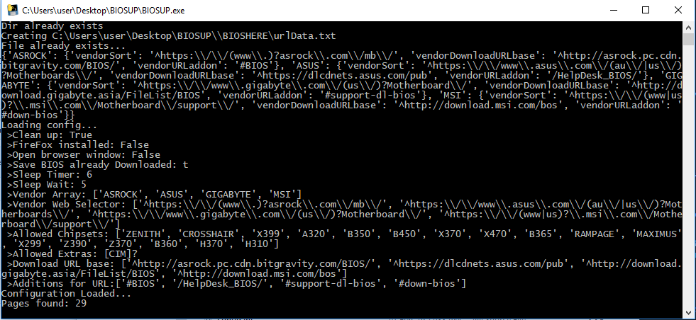

# Biosup
> This program is designed to download all BIOS/UEFI from either ASUS, ASROCK, GIGABYTE or MSI. 

Biosup is a program designed to automate the sourcing and downloading of BIOS/UEFI from Various vendor websites. Using the config file, a user can manually set what chipset's and vendor's (between ASUS, ASROCK, GIGABYTE and MSI) they wish to download.

Furthermore, Biosup features progress saving and full automation, set and forget!

Biosup DOES NOT install the bios for you.

## Installation
No installation needed :D

To run Biosup on:
Windows:

1. Download the latest version from [here](https://github.com/Rexzarrax/Biosup/releases).
2. Unzip the downloaded file.
3. Run CONFIGURATOR.exe.
4. Selected the options you wish to run Biosup with.
5. Click the "Generate Config" button
6. exit the CONFIGURATOR.

7. Run BIOSUP.exe
8. Wait for the script to finish. 

Linux:
1. Download the source code through git
2. Navigate to it through your favourite cli
3. Install the required packages with pip(see requirements.txt) 
4. Using the python interpreter, run the CONFIGURATOR.py script.
5. Selected the options you wish to run Biosup with.
6. Click the "Generate Config" button
7. exit the CONFIGURATOR.

8. Run BIOSUP.py
9. Wait for the script to finish. 

**Note, it is recomended to run this on USB flash storage generally for easy transfer to the PC needing a update.

Use ctrl-c to exit while in linux (or any other process manager)

## Requirements 
Can be found in requirement.txt in main repo [here](https://bitbucket.org/Rexzarrax/biosup/src/master/requirements.txt)

## Credits
Icon made by [Smashicons](https://www.flaticon.com/authors/smashicons) from [Flaticon](https://www.flaticon.com)
