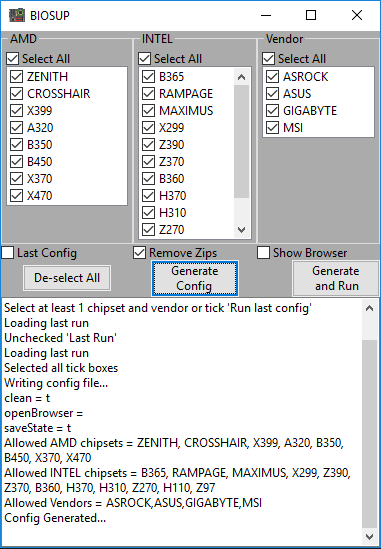

# Biosup
> This program is designed to download all BIOS/UEFI from either ASUS, ASROCK, GIGABYTE or MSI. 


Biosup is a program designed to automate the sourcing and downloading of BIOS/UEFI from Various vendor websites. Using the config file, a user can manually set what chipsets and vendors (between ASUS, ASROCK, GIGABYTE and MSI) they wish to download.

Furthermore, Biosup features progress saving and full automation, set and forget!



## Installation

Windows:

```
1. Download the latest version from [here][https://bitbucket.org/Rexzarrax/biosup/downloads/].
2. Unzip the downloaded file.
3. Run BIOSUP.exe.
```

Linux:
```
Use WINE, detailed steps coming
```
